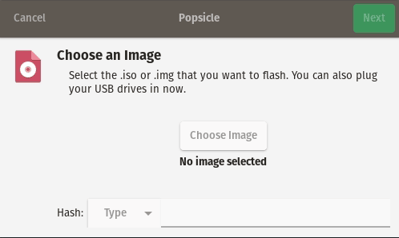

# Popsicle

Popsicle is a Linux utility for flashing multiple USB devices in parallel, written in [Rust](https://www.rust-lang.org/en-US/).

## Build Dependencies

If building the GTK front end, you will be required to install the development dependencies for GTK, usually named `libgtk-3-dev`. No other dependencies are required to build the CLI or GTK front ends, besides Rust's `cargo` utility.

For those who need to vendor Cargo's crate dependencies which are fetched from [Crates.io](https://crates.io/), you will need to install [cargo-vendor](https://github.com/alexcrichton/cargo-vendor), and then run `make vendor`.

## Installation Instructions

 A makefile is included for simply building and installing all required files into the system. You may either build both the CLI and GTK workspace, just the CLI workspace, or just the GTK workspace.

- `make cli && sudo make install-cli` will build and install just the CLI workspace
- `make gtk && sudo make install-gtk` will build and install just the GTK workspace
- `make && sudo make install` will build and install both the CLI and GTK workspaces
