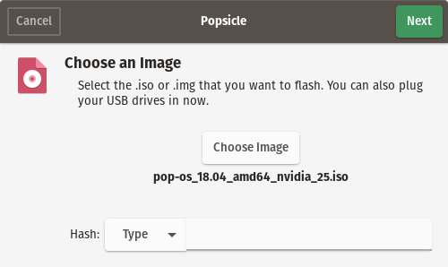
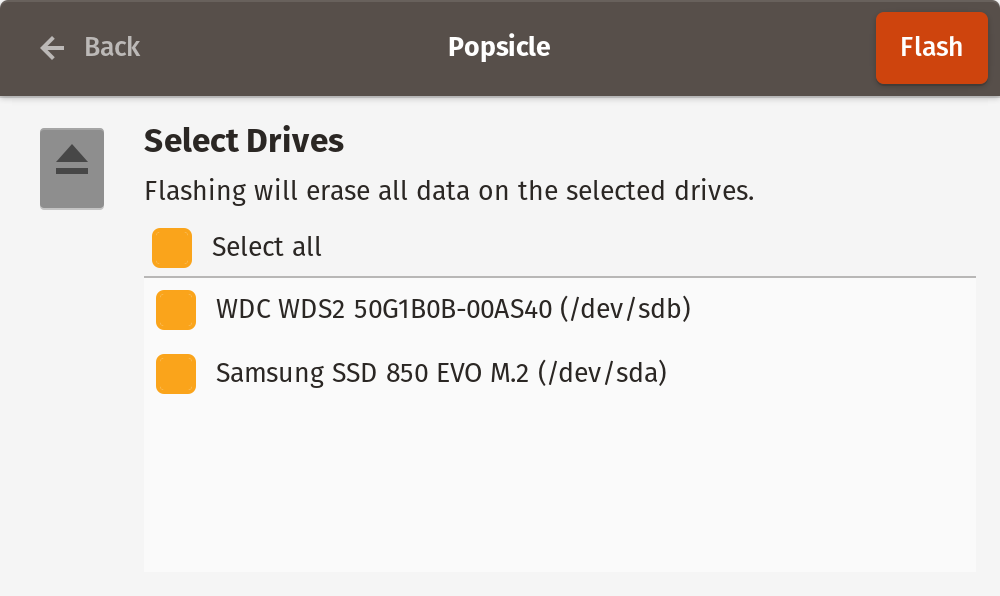
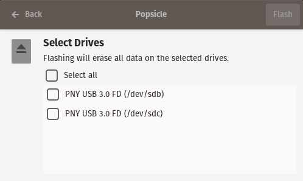
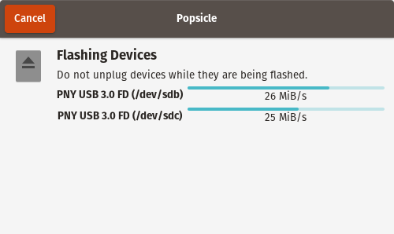
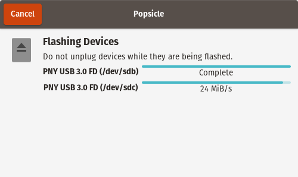
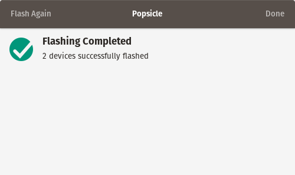

# Popsicle

Popsicle is a Linux utility for flashing multiple USB devices in parallel, written in [Rust](https://www.rust-lang.org/).

## Build Dependencies

You will be required to install the development dependencies for D-Bus and xkbcommon, usually named `libdbus-1-dev` and `libxkbcommon-dev`, along with `pkg-config`. No other dependencies are required besides Rust's `cargo` utility (1.93 or newer).

For those who need to vendor Cargo's crate dependencies which are fetched from [Crates.io](https://crates.io/), you will need to install [cargo-vendor](https://github.com/alexcrichton/cargo-vendor), and then run `make vendor`.

## Installation Instructions

 A makefile is included for simply building and installing all required files into the system: `make && sudo make install`.

A single `popsicle` binary provides both interfaces: run it without arguments (or with an image path) for the COSMIC front end, or with an image and disks (`popsicle image.iso /dev/sdb /dev/sdc`, see `popsicle --help`) for the command line.

## Screenshots

### Image Selection



### Device Selection



The list will also dynamically refresh as devices are added and removed



### Device Flashing




### Summary



## Translators

Translators are welcome to submit translations directly as a pull request to this project. It is generally expected that your pull requests will contain a single commit for each language that was added or improved, using a syntax like so:

```
i18n(eo): Add Esperanto language support
```

Translation files can be found [here](./i18n/). We are using [Project Fluent](https://projectfluent.org) for our translations, which should be easier than working with gettext.

